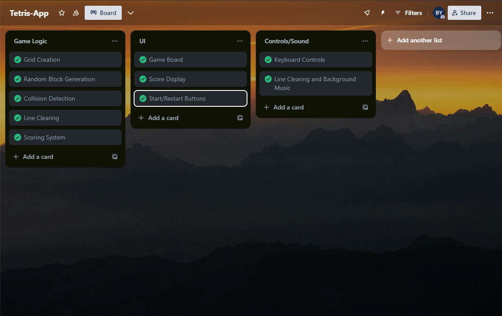
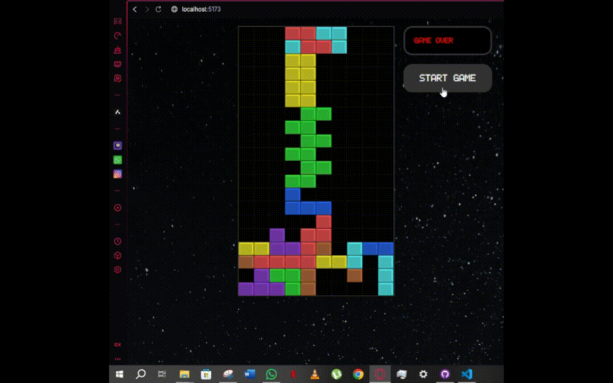
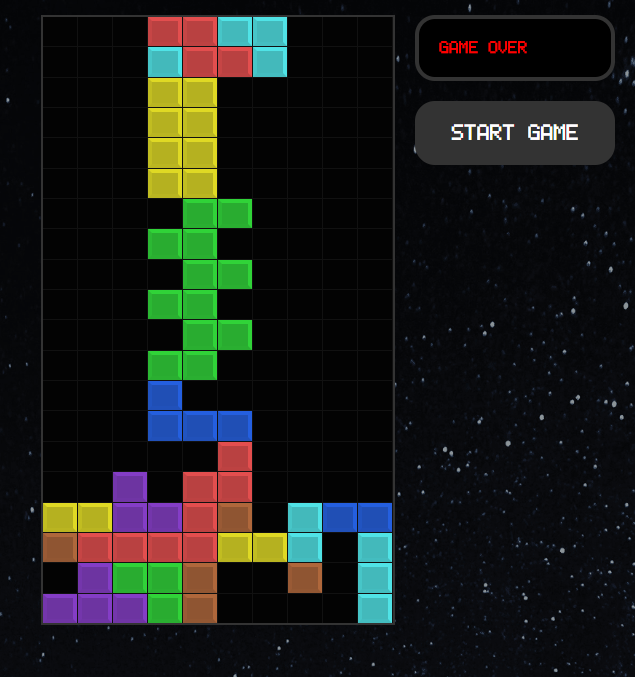
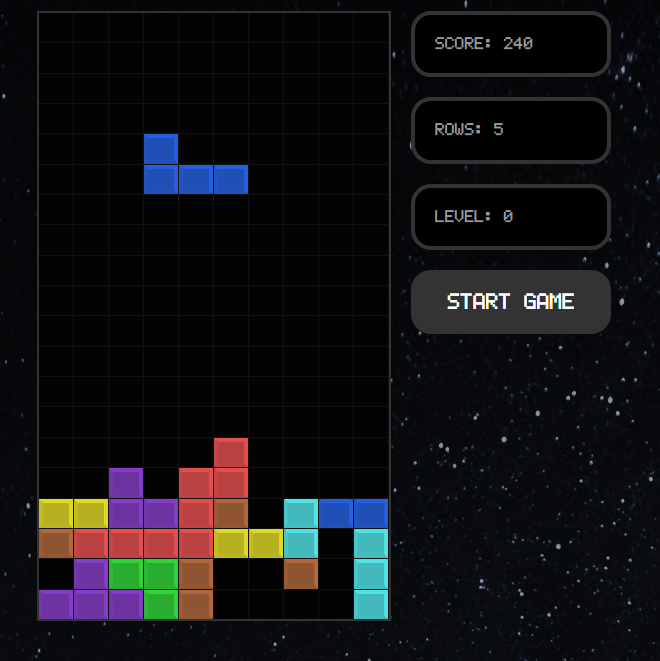

# **Tetris**

A nostalgic attachment to the original and beloved game by many.

---

## **Table of Contents**

- [Project Checklist](#project-checklist)
- [Demo](#demo)
- [Exemplary Screenshots](#exemplary-screenshots)

---

## Project Checklist

### 1. Use and Understand Git

- All project updates are tracked and committed using Git.

| **Command**               | **Used to...** |
|---------------------------|---------------|
| `git init`               | Start version control for the project. |
| `git add .`              | Stage changes before making a commit. |
| `git push origin master`   | Push committed changes to the remote repository. |
| `git pull origin master`   | Fetch and merge the latest updates from the remote repository. |

---

### 2. UML Diagrams

To document the architecture and behavior of *Tetris*, I have created the following **diagrams**:

#### 1️⃣ Use-Case Diagram
The **Use-Case Diagram** visualizes how users interact with the system, showcasing different features available in the CLI.

📌

#### 2️⃣ Uml Diagram
The **Uml Diagram** represents the structural organization of the program, showing how different components communicate.

📌

#### 3️⃣ Activity Diagram
The **Activity Diagram** illustrates the sequence of actions when a user fetches an entry.

📌 

---

### 3. Requirements

#### Currently:

- [Link to Workspace](https://trello.com/b/PJjACiQr/tetris-app)

---

## **Demo**
  
*Above: A brief walkthrough of the core features.*

---

## **Exemplary Screenshots**

### **Start Game**
  
*Above: Resets the board and starts the new game.*

### **GameOver**
  
*Above: When the block reaches the designated cieling.*

### **Scoring**
  
*Above: Updates Score on Line clearing.*

---